# Private Confluent Cloud Kafka on Azure — POC Walkthrough

### Presented By: Sanjeev Kumar MP

This document walks through the POC to provision a private Confluent Cloud Kafka cluster on Azure — reachable only over Private Link, with no public path — entirely through Terraform driven by GitHub Actions, using keyless OIDC auth, and verify a real produce/consume round-trip from inside an AKS pod.

📦 **Github Repository:** [github.com/SanjeevMurthy/uniper-kafka-poc](https://github.com/SanjeevMurthy/uniper-kafka-poc)

- Refer to the repo for the full **repository structure**, the **Terraform code** (stacks, modules, and snippets), and the **GitHub Actions workflows**.

---

## Table of contents

1. [Problem statement](#1-problem-statement)
2. [Solution approach (the design)](#2-solution-approach-the-design)
3. [Architecture diagrams](#3-architecture-diagrams)
4. [Step-by-step: how I built it](#4-step-by-step-how-i-built-it)
5. [How it works under the hood](#5-how-it-works-under-the-hood)
   - 5.1 [How GitHub Actions provisions the resources](#51-how-github-actions-provisions-the-resources)
   - 5.2 [How Private Link is configured between Azure and Confluent](#52-how-private-link-is-configured-between-azure-and-confluent)
   - 5.3 [How AKS pods (producer/consumer) reach Confluent](#53-how-aks-pods-producerconsumer-reach-confluent)
6. [Verification — the smoke test](#6-verification--the-smoke-test)
7. [Security model](#7-security-model)
8. [Results & takeaways](#8-results--takeaways)

---

## 1. Problem statement

Use Terraform to provision a **private Confluent Cloud Kafka cluster** that is reachable only via **Azure Private Link**, create topics and scoped credentials, and make the whole thing **reproducible and tear-down-able on demand**.

**In scope**

- A Confluent environment + a small Kafka cluster, created via Terraform.
- Cloud-side networking for private connectivity (Azure VNet + Private Endpoint + Private DNS).
- **2 topics** (`orders`, `payments`), one application service account, one API key, and ACLs for produce/consume rights.
- An **AKS cluster** (provisioned by Terraform) to smoke-test the private path.
- Documented run steps and verification steps.

**Out of scope**

- Production-grade HA, large clusters, or long-running performance tests.
- Multi-region failover.

---

## 2. Solution approach (the design)

The whole POC is a **two-stack Terraform layout**, driven entirely by **manually-triggered GitHub Actions workflows**. I deliberately split the work into two stacks because they have very different lifecycles:

| Stack                        | What it creates                                                                                                                                                             | How often it runs          |
| ---------------------------- | --------------------------------------------------------------------------------------------------------------------------------------------------------------------------- | -------------------------- |
| `terraform/bootstrap`        | The **identity + state backend**: an Azure AD app with 2 federated OIDC credentials, a resource group + Storage Account + container for Terraform state, and baseline RBAC. | Once (plus rare rotations) |
| `terraform/environments/poc` | The **POC itself**: Confluent environment + Private Link network + Kafka cluster + topics + ACLs, and Azure VNet + Private Endpoint + Private DNS + AKS.                    | Every POC run              |

**The key design decisions, and why:**

- **Keyless OIDC for Azure.** No static Azure client secret exists anywhere. GitHub Actions presents a short-lived OIDC token; Azure AD trades it for a short-lived access token. The federated credential's `sub` claim is bound to a specific GitHub **Environment** (`bootstrap` or `poc`), so a fork or a feature branch cannot impersonate it.
- **Bootstrap runs locally exactly once.** There's a chicken-and-egg problem: the remote state backend doesn't exist yet on the very first run. So bootstrap runs from my laptop with a local backend, creates the Storage Account, then migrates its own state into it.
- **State is locked down.** The state Storage Account has shared-key access **disabled** (AAD-only), blob **versioning enabled**, and `prevent_destroy` on the account.
- **Only one static secret.** The single unavoidable static credential is the Confluent Cloud API key — Confluent doesn't yet support OIDC for Terraform — and it's scoped to GitHub Environments, not the whole repo.
- **Every mutating workflow needs a typed confirmation string** (e.g. you must type the project name to run `apply` or `destroy`). This prevents accidental provisioning/teardown.

---

## 3. Architecture diagrams

### 3.1 End-to-end architecture

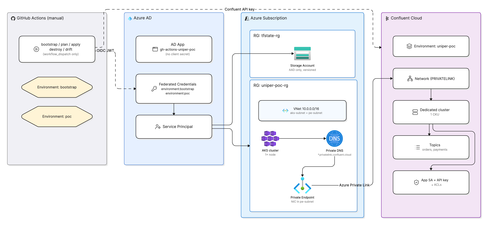

The diagram reads left-to-right across four planes. **GitHub Actions** (manual workflows) presents an **OIDC JWT** to **Azure AD**, which — via the AD app, environment-bound federated credentials, and a service principal (no client secret) — hands back a short-lived token to act on the **Azure Subscription**: the `tfstate-rg` Storage Account for state, and `uniper-poc-rg` holding the VNet, AKS, Private DNS, and Private Endpoint. The same workflows use a **Confluent API key** to build the **Confluent Cloud** side: environment, a `PRIVATELINK` network, a Dedicated cluster, topics, and an app service account with ACLs. The only data path between the two clouds is **Azure Private Link** — the Private Endpoint connects to Confluent's private network, so brokers are reachable from inside the VNet and never over the public internet.

### 3.2 Provisioning sequence — bootstrap (one-time)

Runs locally with a local backend, then migrates its own state into the new Storage Account. This is the only stage that uses an Owner login and runs outside GitHub Actions.

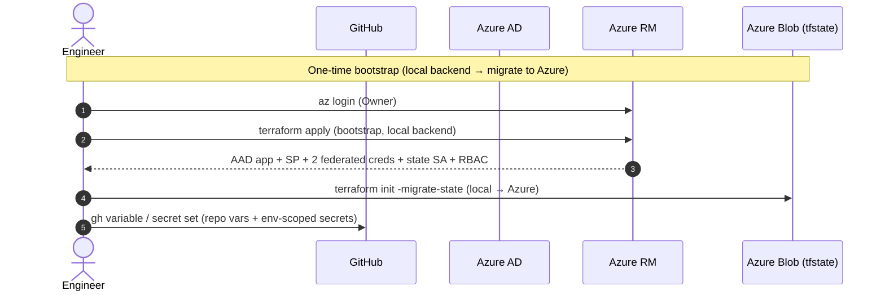

### 3.3 Provisioning sequence — workflow run (plan → apply → verify)

The steady-state loop. Every run authenticates to Azure via keyless OIDC, then Terraform reconciles both Azure and Confluent Cloud.

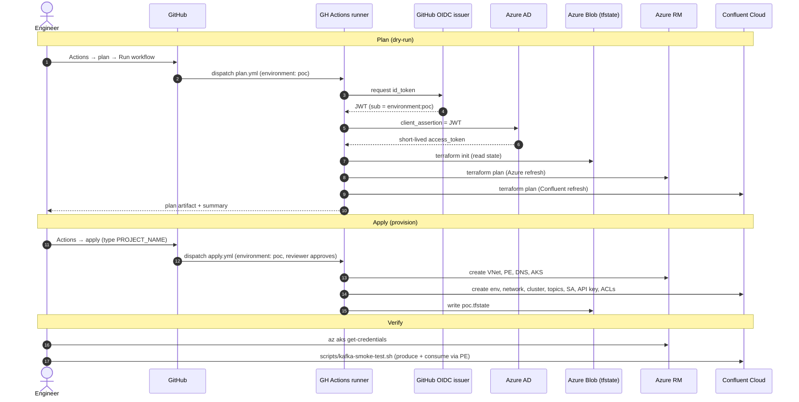

### 3.4 Provisioning sequence — teardown

Tears down only the POC stack. The bootstrap stack (AD app + state Storage Account) survives, so the next run skips the one-time setup.

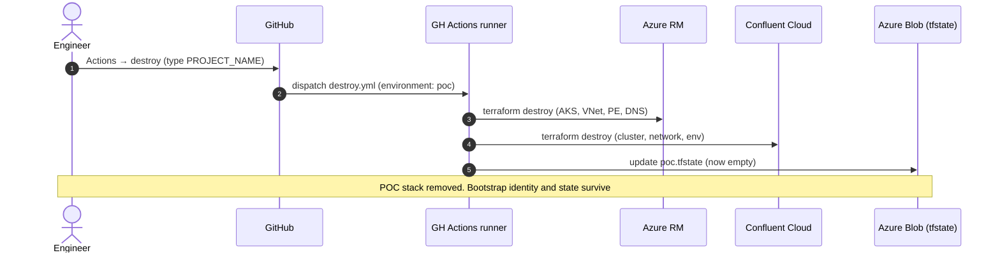

### 3.5 Runtime data path (what the smoke test exercises)

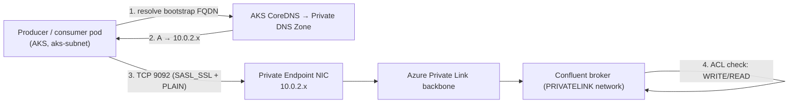

---

## 4. Step-by-step: how I built it

### Step 0 — Local tooling

Installed the CLI toolchain once: `git`, `gh`, `azure-cli`, `terraform`, `jq`, `kubectl`, and the `confluent` CLI, then authenticated `gh` and `az`.

### Step 1 — Account prep

- **Azure:** a subscription where I have **Owner** (needed only for bootstrap), and a tenant where I can create App Registrations and federated credentials.
- **Confluent Cloud:** created a dedicated `tf-provisioner` service account with the **OrganizationAdmin** role, then generated an org-scoped (Global) **Cloud-resource-management API key**. This is the one static secret the POC needs.
- **GitHub:** created a public repo (private recommended) and pushed the code.

### Step 2 — Bootstrap stack (local, one-time)

The bootstrap stack creates the **identity all future workflows use** and the **state Storage Account**. It runs locally the first time because no remote backend exists yet:

1. Filled in `terraform.tfvars` (gitignored): GitHub org/repo, Azure subscription, region, project name.
2. Confirmed `backend.tf` was commented out for the first run.
3. `terraform init && terraform plan -out=tfplan && terraform apply tfplan`.
4. Captured the outputs needed for GitHub: tenant ID, subscription ID, the AD app **client ID**, and the **state Storage Account name**.
5. **Migrated bootstrap's own state** into the new Storage Account (`terraform init -migrate-state ...` with `use_azuread_auth=true`), then deleted the local state files.

This created:

- An **AD application** `gh-actions-uniper-kafka-poc` (no client secret) + its **service principal**.
- **Two federated credentials**, one per GitHub Environment (`bootstrap`, `poc`).
- **RBAC**: `Contributor` at subscription scope + `Storage Blob Data Owner` on the state account.
- The **state Storage Account** (`tfstate-rg` / AAD-only / versioned).

### Step 3 — Configure GitHub

- Created two **Environments** (`bootstrap`, `poc`), each with a required reviewer and locked to the `main` branch only.
- Set repo **variables** (tenant/subscription/client IDs, region, state backend coordinates, Terraform version, project name).
- Set **environment-scoped secrets**: the Confluent API key + secret, scoped to each environment (not repo-wide). A workflow without an `environment:` simply cannot see them.

> **Environment set on GitHub**
> 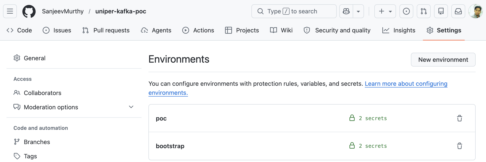

> **PoC Environment on Confluent Cloud**
> 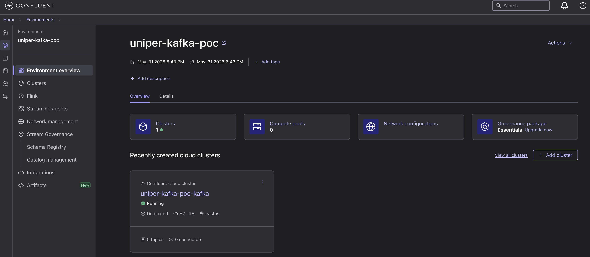

### Step 4 — Apply the POC stack

Triggered the `apply` workflow (`gh workflow run apply.yml -f confirm=uniper-kafka-poc`), which provisions everything: the Confluent environment, Private Link network, Dedicated Kafka cluster, the Azure VNet/PE/DNS, and AKS — then writes `poc.tfstate` to the backend.

| Phase                                       | Duration                         |
| ------------------------------------------- | -------------------------------- |
| OIDC login + `terraform init`               | ~30 s                            |
| Confluent network + Private Link access     | 5–15 min                         |
| Azure VNet + Private Endpoint + Private DNS | 2–5 min (parallel)               |
| Confluent Dedicated cluster                 | 15–30 min (sometimes longer)     |
| AKS cluster                                 | 7–12 min (parallel with cluster) |

> **Resources in Terraform State file**
> 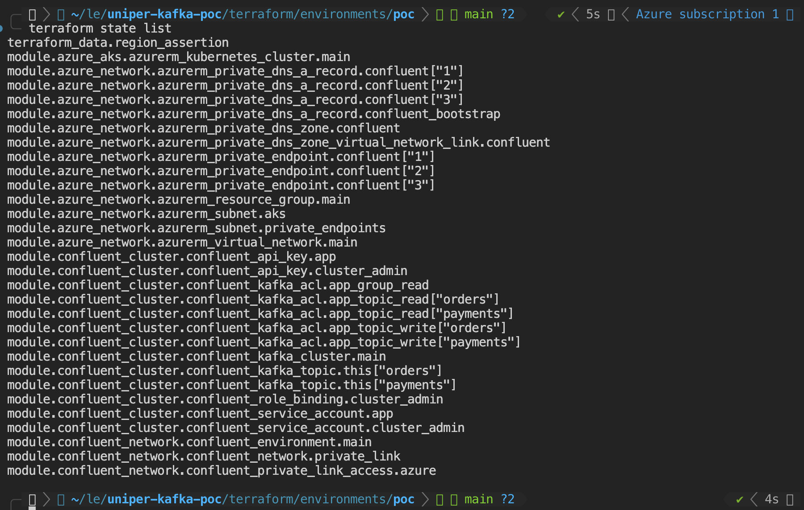

> **Resources in Azure POC Resource Group**
> 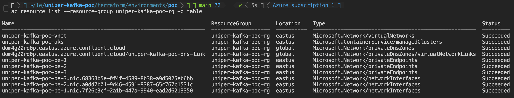

> **Kafka Cluster on Confluent Cloud**
> 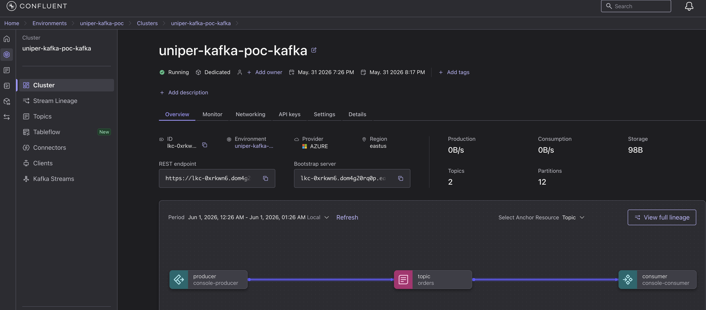

> **Kafka Cluster Networking**
> 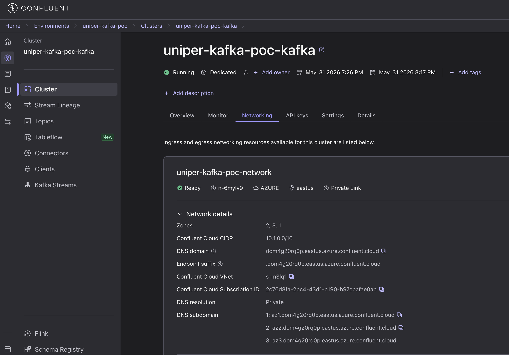

> **Kafka Cluster Details**
> 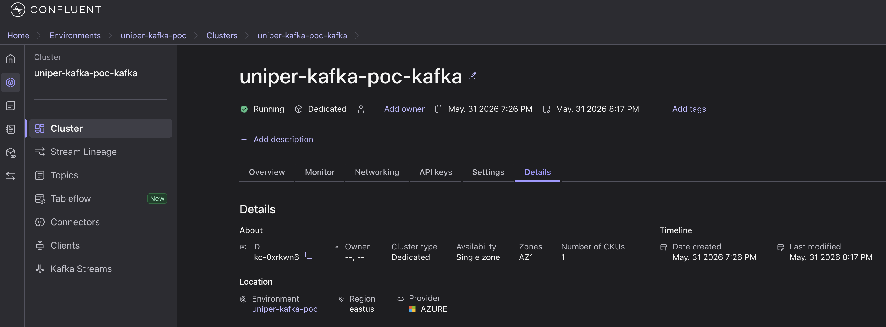

### Step 5 — Verify, then tear down

Ran the smoke test to prove the private round-trip, then used the `destroy` workflow when finished. Tearing down the POC stack leaves the bootstrap stack (AD app + state account) intact, so the next `apply` doesn't repeat Step 2.

---

## 5. How it works under the hood

This section answers the three "how does X actually connect" questions.

### 5.1 How GitHub Actions provisions the resources

**The workflows.** Everything is `workflow_dispatch` (manual) — nothing runs on push. Six workflows:

| Workflow    | Trigger                                       | Environment | Purpose                           |
| ----------- | --------------------------------------------- | ----------- | --------------------------------- |
| `bootstrap` | manual (`plan`/`apply` + `BOOTSTRAP` confirm) | `bootstrap` | One-time identity + state backend |
| `plan`      | manual                                        | `poc`       | Dry-run the POC stack             |
| `apply`     | manual (`PROJECT_NAME` confirm)               | `poc`       | Provision the POC stack           |
| `destroy`   | manual (`PROJECT_NAME` confirm)               | `poc`       | Tear down the POC stack           |
| `drift`     | manual                                        | `poc`       | Compare state to live infra       |
| `tflint`    | manual                                        | —           | fmt / validate / tflint / trivy   |

**The keyless OIDC handshake** (no static Azure secret is ever stored):

1. A workflow runs under a GitHub **Environment** (e.g. `poc`). That gates it behind a required reviewer and unlocks the environment-scoped secrets.
2. The runner asks GitHub's OIDC issuer for an `id_token` (a short-lived JWT). The JWT's `sub` claim is `repo:<org>/<repo>:environment:poc`.
3. The runner sends that JWT to Azure AD as a `client_assertion`. Azure AD checks it against the **federated credential** created in bootstrap — the `sub` must match exactly.
4. Azure AD returns a **short-lived access token**. Terraform uses it (via the service principal's `Contributor` RBAC) to create Azure resources and to read/write state in the Storage Account (via `Storage Blob Data Owner`, AAD-only).
5. In parallel, Terraform authenticates to **Confluent Cloud** with the API key from the environment secret to create Confluent resources.

So the runner never holds a password — only a momentary token bound to that one environment. A fork, a different branch, or a workflow that forgot to set `environment:` cannot complete step 3.

**What `apply` builds, in order:** Confluent network + Private Link access → (in parallel) Azure VNet/PE/DNS and AKS → Confluent Dedicated cluster → topics, ACLs, app service account, and app API key.

<blockquote style="text-align: justify">
<strong>Note — control-plane vs data-plane.</strong> Operations against the Confluent <em>control-plane</em> (creating the environment, network, and cluster) run fine from a GitHub-hosted runner. Creating <strong>topics, ACLs, and the app API key</strong>, however, requires the Confluent provider to reach the cluster's <strong>data-plane REST API</strong>, which is only reachable at private <code>10.x</code> addresses behind Private Link. The runner that manages those resources therefore must sit <strong>inside the VNet</strong> — for example a self-hosted GitHub Actions runner (or HCP Terraform agent) in the AKS cluster or a dedicated subnet.
</blockquote>

### 5.2 How Private Link is configured between Azure and Confluent

Private Link gives a **one-way, private** path from my Azure VNet to Confluent's Kafka brokers, with no traffic ever traversing the public internet. It's built from four pieces:

1. **Confluent side — a `PRIVATELINK` network.** Terraform creates a Confluent network of type `PRIVATELINK` in the same Azure region (`eastus`), plus a **Private Link Access** entry that whitelists my **Azure subscription ID**. Confluent returns a set of **service alias** identifiers (one per availability zone: `az1`, `az2`, `az3`).
2. **Azure side — Private Endpoints.** Terraform creates one **Private Endpoint** per zone in the `pe-subnet` (`10.0.2.0/24`). Each PE is a NIC with a private `10.0.2.x` IP that targets one of Confluent's service aliases. Because this is a **cross-tenant** alias, the connection must be a **manual connection** (`is_manual_connection = true` with a request message) — Confluent auto-approves it on its side because my subscription is on the Private Link access list.
3. **Azure side — Private DNS.** A Private DNS zone matching Confluent's broker domain (e.g. `<id>.eastus.azure.confluent.cloud`) is linked to the VNet. Inside it:
   - **Zonal wildcard records** `*.az1`, `*.az2`, `*.az3` → the matching PE IPs.
   - An **apex wildcard** `*` → all PE IPs, which is what makes the _bootstrap_ FQDN resolve privately.
4. **Result.** Anything inside the VNet that resolves a Confluent broker name gets a `10.0.2.x` answer and routes over the Private Link backbone. Anything outside the VNet either can't resolve it or resolves to an unroutable private IP — which is exactly the isolation we want.

> **Confluent Private Link Network**

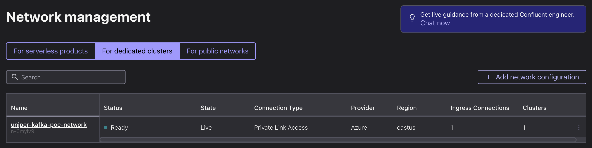

> **List of Private Endpoints on Azure**

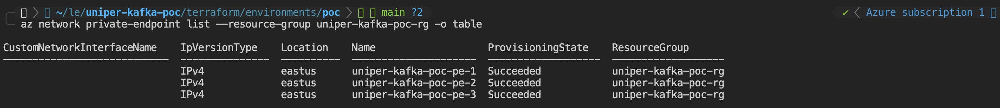

> **Private DNS Zone Records on Azure**

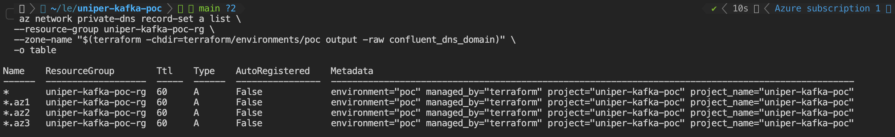

### 5.3 How AKS pods (producer/consumer) reach Confluent

When a producer or consumer pod in AKS connects to Kafka, this is the path (it's exactly what the smoke test asserts):

1. The pod resolves the **bootstrap FQDN** (e.g. `lkc-xxxx.<id>.eastus.azure.confluent.cloud`). AKS **CoreDNS** forwards the query to the **Azure Private DNS zone** linked to the VNet.
2. Private DNS answers with a **private `10.0.2.x`** address (a Private Endpoint NIC) — _not_ a public IP. This single fact proves the private path is wired up correctly.
3. The pod opens **TCP 9092** to that PE IP using **SASL_SSL + PLAIN**, authenticating with the **`poc-app-sa`** API key/secret (delivered to the pod as a Kubernetes Secret). Traffic flows PE → Private Link backbone → broker.
4. At the broker, Confluent enforces **ACLs**: `poc-app-sa` has WRITE/READ on `orders` and `payments`, and READ on consumer groups prefixed `poc-`. The produce/consume succeeds only because those ACLs exist.

Two service accounts keep this clean:

- **`tf-provisioner`** (org-level, `OrganizationAdmin`) — used _only_ by Terraform/CI to build the cluster, stored in GitHub secrets.
- **`poc-app-sa`** (cluster-level, minimal ACLs) — created by Terraform, used by the AKS pods, delivered as a Kubernetes Secret. No human ever handles it.

> **AKS Cluster**

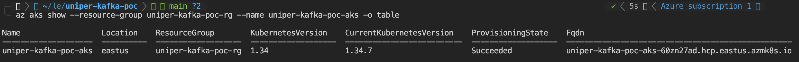

---

## 6. Verification — the smoke test

After `apply`, `scripts/kafka-smoke-test.sh` applies a client pod into AKS and runs a produce/consume round-trip over Private Link. It asserts **four** things:

1. The bootstrap FQDN resolves to a **private `10.0.2.x`** address from inside AKS → Private DNS is wired up.
2. **SASL/PLAIN** auth with the app API key succeeds → the app SA + API key were created correctly.
3. A **produce + consume** round-trip on `orders` succeeds → topic + group ACLs are correct.
4. A TCP connection from my laptop to port 9092 **fails** → the cluster has **no public path** (skippable with `SKIP_NEGATIVE_TEST=1`).

> **Topics on Confluent Cloud**

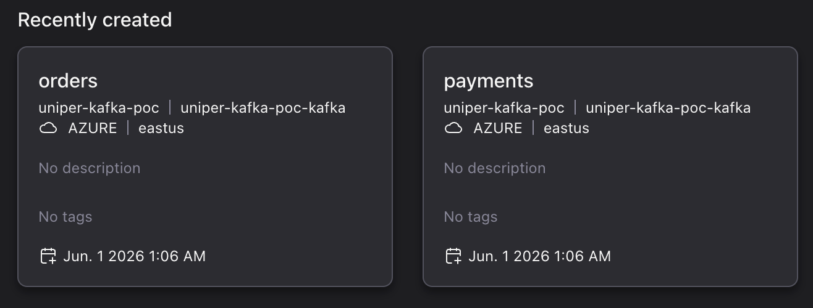

---

## 7. Security model

- **No long-lived Azure secret anywhere.** GitHub Actions authenticates to Azure via **federated OIDC**. The credential's `sub` is bound to a specific GitHub Environment, so forks/branches can't impersonate it.
- **State is hardened.** AAD-only access (shared keys disabled), blob versioning on (so a corrupted state can be restored), and `prevent_destroy` on the account.
- **Least-privilege credentials at runtime.** The AKS pods use `poc-app-sa`, whose ACLs allow only WRITE/READ on `orders`/`payments` and READ on `poc-*` groups — nothing else.
- **One static secret, tightly scoped.** The Confluent API key is the only static credential, scoped to GitHub Environments (not repo-wide), and can be rotated at any time without downtime.

---

## 8. Results & takeaways

**What works, proven:**

- A **private-only** Confluent Kafka cluster on Azure — verified unreachable from the public internet by the smoke test's negative assertion.
- **Keyless** Azure provisioning from GitHub Actions via OIDC — zero static Azure secrets.
- A real **produce/consume round-trip** from an AKS pod over Private Link, with scoped credentials and ACLs.
- **Reproducible and reversible** — `apply` and `destroy` are one command each, and bootstrap survives teardown so re-runs are fast.

**Key takeaways:**

- Splitting **identity/state (bootstrap)** from the **workload (poc)** keeps the one-time, high-privilege setup separate from the repeatable POC runs.
- **Private Link on Azure ⇄ Confluent** hinges on three details: cross-tenant Private Endpoints must be **manual connections**, the cluster must be **Dedicated**, and the **DNS records must include both the zonal `*.azN` and the apex `*`** wildcards.
- **CI runners must sit inside the private network** to manage a private Kafka data-plane — the single most important operational lesson from this POC.
