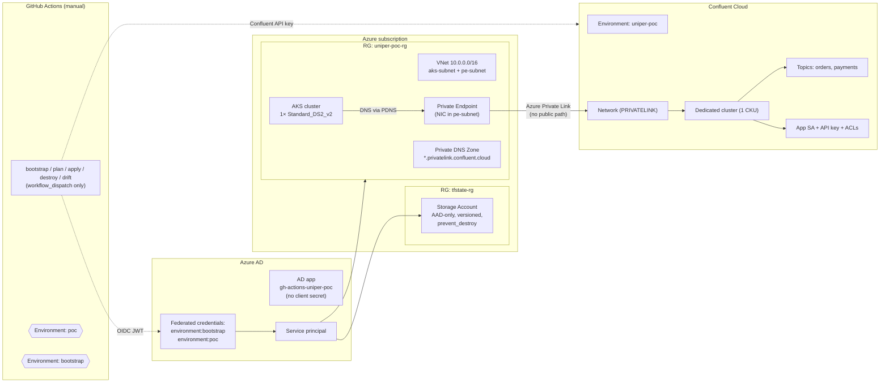
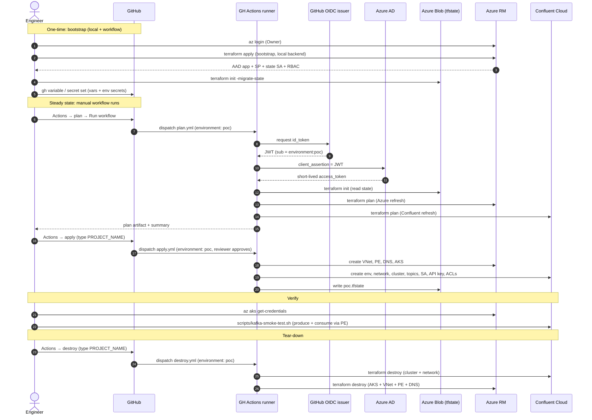
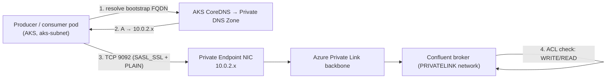

# uniper-kafka-poc

> Private Confluent Cloud Kafka on Azure (via Private Link) + AKS, provisioned
> by Terraform from GitHub Actions using OIDC keyless auth. State lives in
> Azure Blob Storage with versioning and AAD-only access.

[](.github/workflows/bootstrap.yml)
[](.github/workflows/plan.yml)
[](.github/workflows/apply.yml)
[](.github/workflows/destroy.yml)
[](.github/workflows/drift.yml)

---

## 1. Problem statement

We need a reproducible way to stand up a **private, production-shaped Kafka
cluster on Azure** for a POC and tear it down on demand. Constraints:

- **No public Kafka path.** Brokers must be reachable only from inside the
  customer VNet, over Azure Private Link.
- **No long-lived cloud credentials.** Anything that runs in CI must
  authenticate via short-lived federated tokens, not static client secrets.
- **Reproducible from scratch.** A single engineer should be able to provision
  everything, produce + consume a message end-to-end over Private Link, and
  destroy everything within one hour.
- **Lean operational surface.** All provisioning runs **manually** from
  GitHub Actions — no scheduled jobs, no PR plumbing.

## 2. Solution approach

A two-stack Terraform layout driven entirely by manually-triggered GitHub
Actions workflows:

| Stack | Purpose | Run frequency |
|-------|---------|---------------|
| `terraform/bootstrap` | Azure AD app + 2 federated OIDC credentials, RG + Storage Account + container for tfstate, baseline RBAC | One-time + rare rotations |
| `terraform/environments/poc` | Confluent environment + private-link network + Dedicated Kafka cluster + topics + ACLs, Azure VNet + Private Endpoint + Private DNS + AKS | Per POC run |

All POC-stack workflows (`plan`, `apply`, `destroy`, `drift`) run under the
`poc` GitHub Environment, which gates them behind the AAD federated
credential whose `sub` claim is `repo:<org>/<repo>:environment:poc`. There is
**no static Azure credential anywhere** — only a Confluent Cloud API key
(Confluent does not yet support OIDC for Terraform), scoped to the GitHub
Environment.

### 2.1 Architecture



### 2.2 Provisioning sequence



### 2.3 Runtime data path (verified by the smoke test)



## 3. Repo layout

```
.
├── .github/
│   ├── workflows/                  # 6 manually-triggered workflows
│   │   ├── bootstrap.yml           # plan / apply the bootstrap stack
│   │   ├── plan.yml                # dry-run the POC stack
│   │   ├── apply.yml               # provision the POC stack
│   │   ├── destroy.yml             # tear down the POC stack
│   │   ├── drift.yml               # detect drift in the POC stack
│   │   └── tflint.yml              # fmt / validate / tflint / trivy
│   └── actions/terraform-setup/    # Composite: az login + tf init
│
├── terraform/
│   ├── bootstrap/                  # Stack 1: identity + state backend
│   ├── environments/poc/           # Stack 2: the POC environment
│   └── modules/
│       ├── confluent-network/      # env + network + PL access
│       ├── confluent-cluster/      # cluster + topics + SA + API key + ACLs
│       ├── azure-network/          # VNet + PE + Private DNS
│       └── azure-aks/              # AKS cluster
│
├── scripts/
│   ├── verify-oidc.sh              # confirm CI session is the SP, not a UPN
│   ├── kafka-smoke-test.sh         # produce + consume over Private Link
│   └── kafka-client-pod.yaml       # cp-kafka pod for the smoke test
│
├── README.md                       # this file
└── SETUP.md                        # end-to-end setup walkthrough
```

## 4. Test instructions

After `apply` succeeds, run the smoke test from your laptop. It applies a
client pod into AKS, then produces and consumes a message over Private Link.

```bash
# 1. Make sure your kubectl context targets the new AKS cluster
az aks get-credentials \
  --resource-group  "$(terraform -chdir=terraform/environments/poc output -raw resource_group_name)" \
  --name            "$(terraform -chdir=terraform/environments/poc output -raw aks_cluster_name)" \
  --overwrite-existing

# 2. Run the round-trip smoke test (requires az, kubectl, terraform, jq)
bash scripts/kafka-smoke-test.sh
```

The script verifies all four assertions:

1. The bootstrap FQDN resolves to a **private** `10.0.2.x` address from inside
   AKS (proves Private DNS is wired up).
2. SASL/PLAIN auth with the app API key succeeds (proves the cluster admin SA
   created the app SA + API key correctly).
3. A produce + consume round-trip on the `orders` topic succeeds (proves the
   topic ACLs are correct).
4. A TCP connection from your laptop to port 9092 **fails** (proves the
   cluster has no public path). Skip this assertion with
   `SKIP_NEGATIVE_TEST=1`.

For step-by-step setup from a clean machine, see [`SETUP.md`](./SETUP.md).

## 5. Workflows at a glance

| Workflow | Trigger | Environment | Purpose |
|----------|---------|-------------|---------|
| `bootstrap` | `workflow_dispatch` (`plan`/`apply` + `BOOTSTRAP` confirm) | `bootstrap` | One-time identity + state backend |
| `plan` | `workflow_dispatch` | `poc` | Dry-run the POC stack |
| `apply` | `workflow_dispatch` (`PROJECT_NAME` confirm) | `poc` | Provision the POC stack |
| `destroy` | `workflow_dispatch` (`PROJECT_NAME` confirm) | `poc` | Tear down the POC stack |
| `drift` | `workflow_dispatch` | `poc` | Compare state to live infra |
| `tflint` | `workflow_dispatch` | — | fmt / validate / tflint / trivy |

Every mutating workflow requires a typed confirmation string, runs under a
GitHub Environment (so secrets are scoped), and uses OIDC for Azure auth.

## 6. Security model

GitHub Actions authenticates to Azure via **federated OIDC** — no long-lived
client secret exists anywhere. The federated credential's `sub` claim is
bound to a specific GitHub Environment (`bootstrap` or `poc`) so a fork or
feature branch cannot impersonate it. Terraform state lives in an Azure
Storage Account with shared-key access **disabled** (AAD-only), blob
versioning **enabled**, and `prevent_destroy` on the storage account itself.
The only static credential is the Confluent Cloud API key, scoped to GitHub
Environments (not repo-wide).
